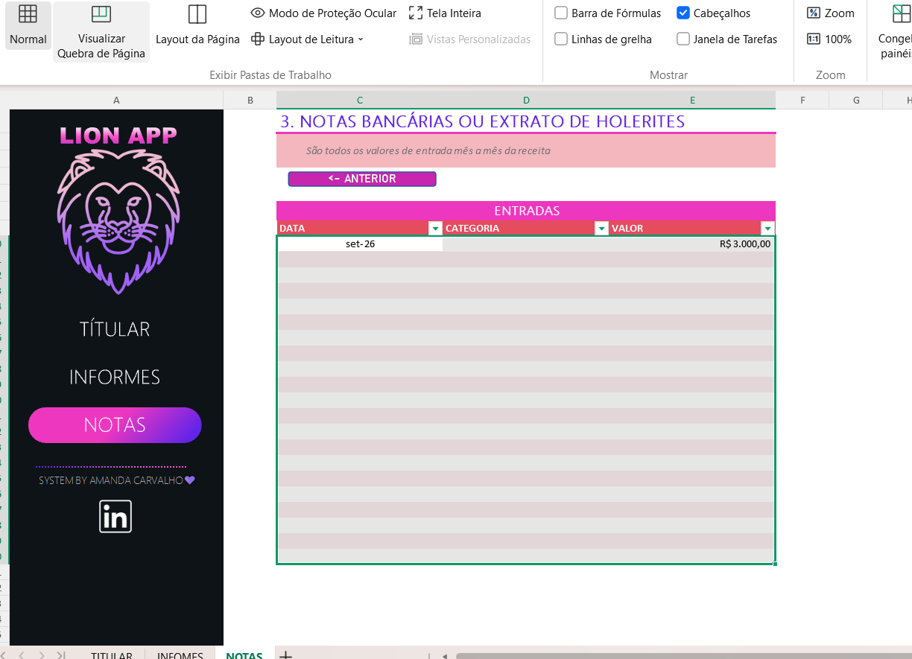
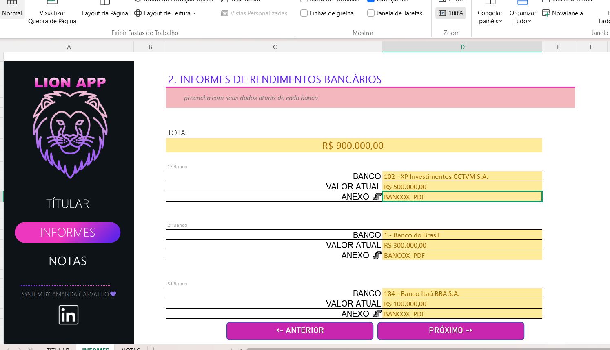
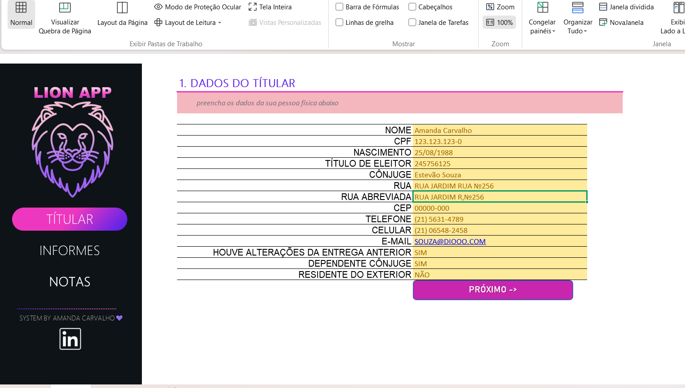

# LION APP - Agregador de Dados para IRPF em Ambiente Cloud (Excel + Azure) 📊🦁

Este repositório contém a solução desenvolvida para o desafio de projeto da **[Digital Innovation One (DIO)](https://dio.me)**. O **LION APP** é uma ferramenta prática, interativa e altamente segura desenvolvida do zero no Excel/WPS Office para auxiliar no controle, organização e validação de dados financeiros essenciais para a Declaração Anual de Imposto de Renda (IRPF).

---

## 🎯 Objetivos do Projeto
*   **Centralização de Dados:** Reunir em um só lugar todas as informações do Titular (Nome, CPF, Título de Eleitor, etc.), rendimentos e despesas dedutíveis.
*   **Interface Amigável e Portátil:** Criação de um menu de navegação prático que funciona em qualquer software (Excel ou WPS Office) de forma leve e responsiva.
*   **Segurança em Nuvem:** Planejamento de hospedagem da ferramenta dentro de uma Máquina Virtual Windows no Microsoft Azure para proteção de dados fiscais sensíveis contra acessos locais não autorizados.

---

## 🏗️ Recursos e Soluções Implementadas

### 1. Ferramenta de Controle (Microsoft Excel / WPS Office)
A planilha foi estruturada focando em uma experiência de usuário limpa, profissional e totalmente funcional:
*   **Aba Titular:** Organização completa dos dados cadastrais obrigatórios para a declaração (CPF, Título de Eleitor, Contatos, etc.).
*   **Menu de Navegação Inteligente:** Em vez de macros que exigem versões pagas e podem apresentar falhas de compatibilidade, o sistema utiliza **Hiperlinks Dinâmicos Diretos nas Células/Botões**. Ao clicar nos botões "Titular", "Informes" ou "Notas", o usuário transita instantaneamente pelas abas e é direcionado para links externos (como o perfil do LinkedIn).
*   **Tratamento e Validação de Dados:** Aplicação de máscaras de formatação personalizada para CEP, Telefone, Celular e CPF, padronizando a entrada de dados.
*   **Governança e Proteção de Células:** O design, os rótulos de texto e as células contendo fórmulas de soma foram totalmente bloqueados e protegidos. O usuário consegue clicar e modificar exclusivamente os campos amarelos de preenchimento de dados, tornando a ferramenta totalmente à prova de erros acidentais.

### 2. Infraestrutura em Nuvem (Microsoft Azure)
Seguindo as orientações de boas práticas de segurança em TI:
*   **Virtual Machine (VM):** Estudo de implantação de uma instância executando Windows via Portal do Azure para manipulação segura da planilha em ambiente virtual criptografado.

---

## 📂 Estrutura do Repositório

```text
├── captura.png            # Print da interface - Dados do Titular
├── captura 1.png          # Print da interface - Informes de Rendimentos
├── captura 2.png          # Print da interface - Notas Bancárias
├── LION_APP_IRPF.xlsx     # Arquivo principal do projeto Excel protegido
└── README.md              # Documentação oficial do projeto
```

---

## 📸 Capturas de Tela do Sistema

Aqui está a demonstração visual do **LION APP** rodando diretamente na interface de usuário:

### 1. Dados do Titular
Campos de cadastro obrigatórios e máscaras de dados automáticas em funcionamento.


### 2. Informes de Rendimentos Bancários
Painel com os bancos e o cálculo consolidado de saldos automáticos.


### 3. Notas Bancárias e Extratos de Holerites
Controle de entradas mensais integrado aos links de navegação rápida.



---

## 🚀 Como Utilizar a Ferramenta

1.  **Download:** Baixe o arquivo `LION_APP_IRPF.xlsx` deste repositório.
2.  **Navegação:** Use os botões com hiperlinks integrados para navegar pelas seções ("Próximo", "Anterior") e acessar os links externos.
3.  **Preenchimento:** Insira seus dados cadastrais e financeiros nas áreas permitidas (células amarelas). O restante do aplicativo está protegido para sua segurança.

---

## 🧠 Aprendizados e Superação Técnica
O maior destaque deste projeto foi a **adaptabilidade técnica**. Diante de barreiras operacionais locais para execução de scripts VBA (Macros), a arquitetura do menu foi completamente redesenhada utilizando hiperlinks nativos de alta portabilidade e recursos avançados de proteção de células. Isso garantiu que o projeto funcionasse perfeitamente em qualquer plataforma, simulando o comportamento de um aplicativo real de mercado de forma independente.

---

## 👤 Autor

Desenvolvido por **Amanda Carvalho**  
*   [Meu GitHub](https://github.com)

---
*Este projeto faz parte do bootcamp da DIO. Sinta-se à voltar para dar uma estrela ⭐️ se este repositório te ajudou!*
# lion-app-irpf
